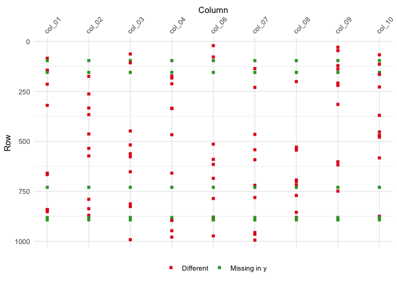

<!-- README.md is generated from README.Rmd. Please edit that file -->

# different


Tools for comparing and resolving differences between data frames.

## Installation

``` r
devtools::install_github("gerkelab/different@dev")
```

## Demonstration

Suppose you have two data sets that you would like to compare.

``` r
x
#> # A tibble: 996 x 11
#> # Groups:   id_01, id_02 [996]
#>    id_01 id_02 colname_01 colname_02 colname_03 colname_04 colname_05
#>    <chr> <chr> <chr>      <chr>           <int> <fct>           <int>
#>  1 jwmq… nhxu… pwxvgf     uvwtvc             20 b                 -37
#>  2 edps… yjhk… hrlqtz     hxeucz             46 a                   7
#>  3 ykal… sazu… abptix     jiuvod            -20 g                   7
#>  4 bemr… plsf… bwgyok     vzvsuj             -2 c                 -14
#>  5 rseu… umjp… wghpbq     ldkdbn             -2 h                 -29
#>  6 mded… rlyy… gaezvt     wiirlg              3 c                 -38
#>  7 qxqd… mtgl… phunsl     bsxvoo             50 a                   3
#>  8 rwau… htcy… irboxg     kacplf            -11 h                 -28
#>  9 jlfb… foac… iweywv     sxcnhv              8 h                 -38
#> 10 pird… aqoe… vsnlia     vovrjp            -35 i                  33
#> # ... with 986 more rows, and 4 more variables: colname_06 <int>,
#> #   colname_07 <chr>, colname_08 <chr>, colname_10 <int>
```

``` r
y
#> # A tibble: 993 x 10
#> # Groups:   id_01, id_02 [993]
#>    id_01 id_02 colname_01 colname_02 colname_04 colname_05 colname_06
#>    <chr> <chr> <chr>      <chr>      <fct>      <chr>           <int>
#>  1 bwjl… lhri… ajltcz     fyznuc     f          18                 38
#>  2 pefj… vdeh… mslfwp     spoxof     a          -16               -18
#>  3 yeev… jwue… leisxo     qmbpdo     h          10                -29
#>  4 herd… anfh… fdprqg     mtdacb     a          -27               -19
#>  5 ydmj… pjrk… vgvkqn     lclsci     f          31                 46
#>  6 pdnv… vzdq… safrup     lahlvy     i          19                -46
#>  7 wohv… xwti… uxtimp     zuvrqb     f          -21               -44
#>  8 lpqc… atog… iaynzf     trmxkp     b          46                 44
#>  9 lzrs… oyyr… trjucy     jmtbxm     f          -28               -40
#> 10 fmbt… hlip… iegvcp     ofcqmh     e          20                -14
#> # ... with 983 more rows, and 3 more variables: colname_07 <chr>,
#> #   colname_08 <chr>, colname_10 <int>
```

Both have ID columns `id_01` and `id_02`, but we know they will differ
in their number of rows and columns and that the rows are unordered.

``` r
> z <- different::diff_compare(x, y, group_vars = c("id_01", "id_02"))
```

``` r
> z
<diff_tbl: x vs y>
❯ There were 243 differences across 8 cols and 152 rows
```

``` r
> summary(z)
── different: Comparison Summary ─────────────────────────────────────────────────────────
# Dimensions
    set    rows  cols
    ----- ----- -----
    x       996    11
    y       993    10

# Columns
● x has 1 unique column:
    `colname_03`
● There are 10 columns that appear in both
  ✔ 2 cols are identical: 
    `id_01`, `id_02`
  ✖ 8 cols have differences: 
    `colname_01`, `colname_02`, `colname_04`, `colname_05`, `colname_06`, `colname_07`, 
    `colname_08`, 
    `colname_10`

# Differences
❯ There were 243 differences across 8 cols and 152 rows
    variable   type.x    type.y    state    miss_count diff             
    -----      -----     -----     -----         ----- ------           
    colname_01 character character diff             31 <tibble [31 × 7]>
    colname_02 character character diff             31 <tibble [31 × 7]>
    colname_04 factor    factor    diff             29 <tibble [29 × 7]>
    colname_05 integer   character diff             30 <tibble [30 × 7]>
    colname_06 integer   integer   diff             29 <tibble [29 × 7]>
    colname_07 character character diff             31 <tibble [31 × 7]>
    colname_08 character character diff             31 <tibble [31 × 7]>
    colname_10 integer   integer   diff             31 <tibble [31 × 7]>
    id_01      character character same              0 <NULL>           
    id_02      character character same              0 <NULL>           
    colname_03 integer   <NA>      unique_x         NA <NULL>           
```

``` r
> plot(z)
```



You can also create an HTML document reporting all of the found
differences with `diff_report()`.

``` r
different::diff_report(x, y, keep_original = TRUE, use_DT = TRUE)
```
