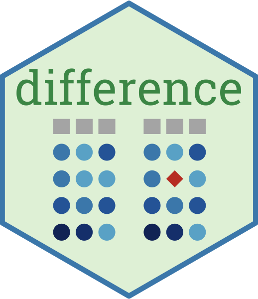

<!-- README.md is generated from README.Rmd. Please edit that file -->

# different


Tools for comparing and resolving differences between data frames.

## Installation

``` r
devtools::install_github("gerkelab/different")
```
